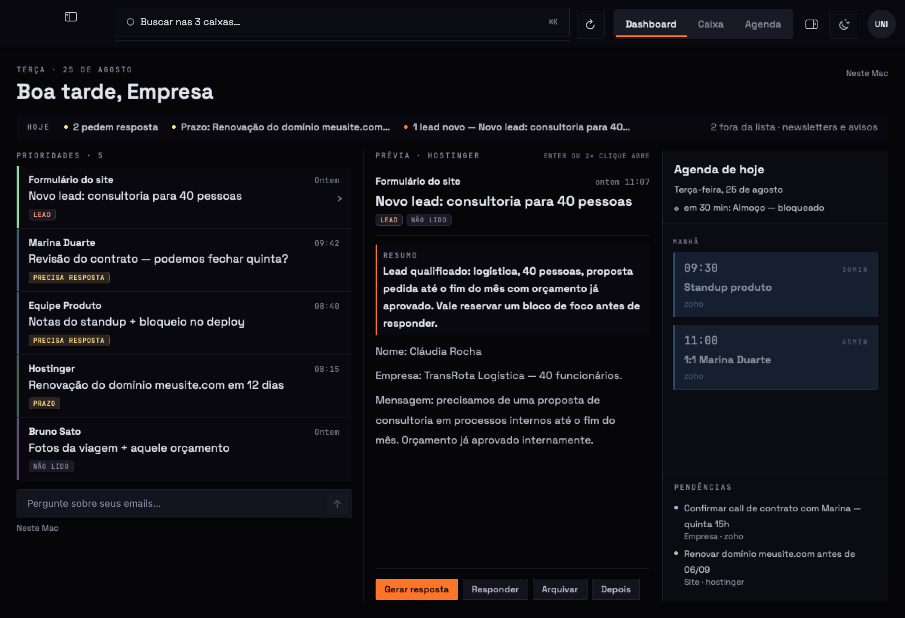
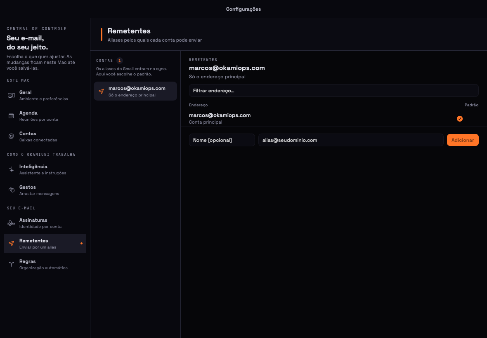

<div align="center">

# 🐺 OkamiUNI

**Email e agenda, juntos, nativos, do jeito que o macOS merece.**


</div>

## TL;DR

- 📬 **Um app só** para email e agenda — Dashboard, Caixa e Agenda no mesmo chrome. A trilha do dia mora ao lado do leitor, e selecionar uma caixa filtra **as duas**.
- 🎯 **O painel do dia não é uma caixa de email**: o plano de hoje numa linha do tempo (agenda + prazos + o que você prometeu, com blocos que a IA propõe e você aceita de uma vez), quem espera você em azulejos com a resposta já escrita, o que vence com valor, e o filtro por negócio. A leitura fica na Caixa.
- 🧠 **Corpo legível, não parede de texto**: histórico citado, assinatura e rodapé de newsletter colapsam atrás de uma dobra; lista vira lista, bloco `Chave: valor` vira lista alinhada, URL crua vira link curto. O resumo abre a prévia, e o que o email **pede** — resposta, prazo — vira selo no topo.
- 🔗 **Link não abre sozinho**: clique pergunta antes, mostrando o endereço completo com o **host real destacado dentro dele** — `https://banco.com@malicioso.example` diz que o site é `malicioso.example`. IDN volta para ASCII, para o alfabeto não trocar de nome no meio do caminho.
- 🔄 **As contas se mantêm sozinhas**: IMAP IDLE, Gmail incremental por histórico, e a rede que volta acorda tudo. Ação feita offline chega ao servidor quando a conexão volta — com fila transacional, retry e "tentar de novo" explicado.
- 📖 **Leitor de verdade**: HTML renderizado (JavaScript morto, imagem remota bloqueada por padrão com memória de confiança por remetente), conversas agrupadas em pilha, convite de agenda vira cartão com "Colocar na agenda" — sem duplicar, por UID.
- ✉️ **Enviar envia**: Gmail pela API, qualquer IMAP por SMTP próprio (STARTTLS antes da senha), caixa Enviadas, resposta com `In-Reply-To`, idempotência por Message-ID — timeout ambíguo nunca duplica email. Contas Google escolhem o **alias** na linha De; os 19 “Enviar como” do Workspace entram no sync.
- 🗂️ **As pastas do provedor** na barra lateral, expansíveis por conta — e um arquivar que **cria** a pasta que falta no servidor em vez de parar a fila.
- 📅 **Agenda real e convites**: EventKit lê e grava calendários do macOS (inclusive CalDAV configurado no sistema), e o cartão responde `Aceitar · Talvez · Recusar` por iTIP, pela mesma fila offline do email.
- 📎 **Anexos de verdade**: recebidos aparecem no leitor e salvam sob demanda; o composer envia arquivos em `multipart/mixed`, com limite explícito e nome sanitizado.
- 📶 **A barra fina diz o que está acontecendo**: cor nela significa uma coisa só — trabalho agora. Parada, é trilho cinza; sem saber quanto falta, um cursor atravessa; com fração conhecida, enche de verdade; falha fica vermelha e imóvel.
- ✨ **Inteligência com destino honesto**: o Foundation Models resume e identifica compromissos, responde perguntas sobre o email/conversa aberta e atua no composer (resumir, reescrever, encurtar, ajustar tom, corrigir e criar resposta) — e, quando você escolhe Grok, LiteLLM, Codex ou um CLI, o app **diz para onde o conteúdo vai**, em cada superfície, antes de mandar.
- 🖱️ **Ações onde a mão espera**: botão direito custom em toda superfície, arraste lateral com Desfazer, atalhos de verdade (`⌘R` `⇧⌘R` `⇧⌘F` `⌘E` `⌫` `⇧⌘L` `⇧⌘U` `⌘N` `⌘K`).
- 🎨 **26 temas**, hairlines de 1 pixel em telas 1×, semáforos a 22pt **verificados por ensaio** — o polimento é requisito, não acabamento.
- 🔌 **Qualquer provedor**: nada no código limita provedor, domínio, número de contas ou de pastas.
- ✅ **2247 testes** que provam por mutação: cada teste novo só conta depois de falhar com o defeito reintroduzido.

```bash
Tools/rodar.sh     # mata a instância antiga, regenera o projeto, compila e abre
```

---

## Por que existe

Cliente de email é o app que mais horas passa aberto — e o que menos respeito costuma receber: web view, ações escondidas, agenda em outro app. O OkamiUNI nasce do desenho ([`design/`](design/), a fonte da verdade deste repositório) para o binário nativo, com uma regra que atravessa tudo: **controle que existe faz alguma coisa** — ou aparece desabilitado explicando por quê. Botão mudo é defeito, não estado.

## O que já funciona

### Marco 1 — o shell

| Área | O que tem |
|---|---|
| 📥 **Caixa de entrada** | Fluxo de triagem (Hoje · Depois · Tudo · Arquivado · Lixeira · **Spam** · **Enviadas** · **Rascunhos**), busca na caixa atual com selo **Tudo** depois de digitar, filtro por conta que alcança lista **e** agenda, ponto + fundo de não-lida, estrela de sinalizada, data honesta na linha |
| ↔️ **Arraste na linha** | Duas ações por lado, persistidas e configuráveis; a linha **para** aberta, o disparo longo inunda de cor antes de executar, destrutivo tem Desfazer |
| 🖱️ **Botão direito** | Menu custom no idioma do design em 10 superfícies — responder, responder a todos, encaminhar, arquivar, apagar, sinalizar, mover, copiar; submenu, atalhos exibidos, navegação por teclado (↑↓⏎→← Esc) |
| ⌨️ **Atalhos** | Menu **Mensagem** na barra do sistema; `⌘R` responder · `⇧⌘R` responder a todos · `⇧⌘F` encaminhar · `⌘E` arquivar · `⌫` apagar · `⇧⌘L` sinalizar · `⇧⌘U` lida/não lida · `⌘N` nova · `⌘K` busca — e campo de texto nunca perde tecla sem modificador |
| ✍️ **Composer** | NSTextView de verdade: formatação **na seleção**, tabelas (Enter não quebra), hyperlink, justificado, cor livre, fontes do sistema, assinatura por conta; a faixa de resposta rápida nasce recolhida e o rascunho sobrevive ao recolher |
| 🪟 **Janelas** | Composer, nova mensagem, mensagem destacada e detalhe de compromisso são cenas reais (⌘W, menu Janela, uma por valor) — todas com o cabeçalho **na linha do semáforo**, verificado por ensaio |
| 🎨 **Shell** | 26 temas com tokens de ponta a ponta, hairlines de 1 pixel de dispositivo, duplo clique na barra respeitando a preferência do sistema, painéis redimensionáveis com intenção preservada |

### Marco 2 — contas de verdade

| Área | O que tem |
|---|---|
| 🔐 **OAuth do Google** | PKCE S256 validado contra o vetor oficial do RFC 7636, redirect derivado do próprio client ID, refresh com corrida única por conta, `client_secret` de app desktop |
| 📡 **IMAP para qualquer provedor** | Cliente próprio sobre SwiftNIO com framing de literais, STARTTLS obrigatório **antes** de qualquer credencial, detecção de servidor por endereço, toda espera com teto e cancelamento |
| 🔑 **Segredos** | Só no Keychain — nunca em banco, log ou arquivo. Assinatura estável do binário: o Keychain pede a senha **uma vez**, não a cada build |
| 💾 **Local-first** | SQLite (GRDB) com FTS5 de acento dobrado no corpo, carga retomável dos últimos 90 dias — o app abre **offline**. Sem conta conectada, ele continua sendo o shell do Marco 1, com as fixtures |

### Marco 3 — sincronização de verdade

| Área | O que tem |
|---|---|
| 🔄 **Sync contínuo** | IMAP IDLE (reengate ≤25min, DONE que sai sempre) com delta de chegadas/bandeiras/expurgos; Gmail incremental por `history.list` com recarga idempotente quando o marcador expira; `NWPathMonitor` acorda sync **e** fila quando a rede volta |
| 📤 **Fila espelhada** | Toda ação (arquivar, apagar, lida, estrela, mover, enviar) persiste e enfileira **na mesma transação**; executor por conta com claim atômico, backoff, e idempotência por UUID. Falha permanente **para com a causa na tela** e "Tentar de novo" — que religa de verdade. Fila parada sobrevive ao reinício e não executa nada fora de ordem |
| 📖 **Leitor rico** | HTML sanitizado (script/iframe/form fora, `cid:` embutido, anexo inline do Gmail buscado pela API) numa WebView **travada**: JS morto, zero requisição remota por padrão, links no navegador. Imagem remota com "Carregar" por mensagem e **"Sempre carregar deste remetente"** (endereço exato, revogável). Email de largura fixa **encolhe para caber**; `height:100%` de marketing não colapsa; espera tem **roda + texto plano legível por baixo**, e voltar à mensagem é instantâneo (acervo de sessão, nada em disco) |
| 🧵 **Conversas** | Agrupadas por `threadId` (Gmail) / corrente de References (IMAP) / assunto normalizado (fallback), uma linha por conversa com contagem, pilha cronológica no leitor (anteriores recolhidas), ações da linha alcançam a conversa inteira — e a resposta enviada carrega `In-Reply-To` |
| ✉️ **Envio** | RFC 5322 de verdade (RFC 2047 no assunto, multipart texto+HTML, Message-ID próprio); Gmail pela API, IMAP por SMTP (EHLO→STARTTLS→AUTH, dot-stuffing) + APPEND em Enviadas; **pela fila**: offline funciona, greylisting re-tenta, endereço recusado explica, timeout ambíguo checa antes de reenviar |
| 🗂️ **Pastas do provedor** | LIST com special-use (RFC 6154) e labels do Gmail na barra lateral, expansíveis por conta, não-lidas por pasta; destino de move que não existe é **criado** no servidor e a operação repete |
| 📅 **Agenda que lembra** | Convite (`text/calendar`) vira cartão com organizador, participantes, local limpo, link da reunião e "Colocar na agenda" — dedup por UID (50 encaminhamentos = 1 evento), "Convite atualizado" **atualiza**. Compromisso criado sobrevive ao reinício; "Entrar" abre a reunião; a mensagem de origem se lê dentro do compromisso |
| 👥 **Contatos reais** | O autocomplete sugere para quem você já escreveu, por frequência e recência — newsletters e outros remetentes recebidos não viram contatos; as fixtures só ficam para quem não conectou nada |

### Marco 4 — agenda real, RSVP e anexos

| Área | O que tem |
|---|---|
| 📅 **Agenda do sistema** | EventKit lê, cria, atualiza e remove compromissos nos calendários do macOS — iCloud, Exchange e CalDAV já configurados no sistema. A permissão só é pedida quando a pessoa aperta “Permitir acesso”; recusada, a causa continua visível. O cliente CalDAV direto cobre discovery, consulta, `PUT` e remoção com transporte injetável, pronto para composição quando houver configuração explícita da conta |
| ✉️ **RSVP por iTIP** | O convite oferece **Aceitar · Talvez · Recusar**; a decisão e o `METHOD:REPLY`/`PARTSTAT` entram na mesma transação do outbox, sobrevivem ao reinício e saem por Gmail ou SMTP. Repetir a mesma resposta não duplica; mudar de ideia cria a nova intenção |
| 📎 **Anexos recebidos** | IMAP e Gmail preservam metadados sem carregar BLOB na lista; o leitor mostra nome e tamanho, busca só o arquivo pedido, reutiliza cache local e abre o painel de destino apenas por ação explícita |
| 📤 **Anexos enviados** | Composer e resposta rápida escolhem arquivos reais; a fila guarda os bytes até a confirmação e o MIME usa `multipart/mixed`, alternativa texto+HTML interna, base64 em linhas de 76 caracteres, nome sanitizado e teto de 25 MiB por arquivo |

### Marco 5 — inteligência no dispositivo

| Área | O que tem |
|---|---|
| 🏠 **Dashboard** | Terceira aba do chrome. Redesenhado três vezes até virar o painel do dia (0.5) — ver abaixo |
| 🪪 **Remetentes** | Configurações → Remetentes. O Gmail traz “Enviar como” no sync; o composer escolhe o From. Alias precisa existir no Workspace para o Gmail não reescrever |
| ✨ **Análise local** | Foundation Models recebe assunto e corpo, com saída tipada, e produz resumo mais compromisso detectado sem tirar o email do Mac; corpo longo é cortado por busca binária no maior prefixo que cabe no orçamento de tokens do próprio modelo, sem número mágico de caracteres. A análise automática continua no Mac por padrão; usar o provedor configurado nela é opt-in explícito, com a consequência escrita no toggle |
| 💾 **Pipeline durável** | SQLite guarda hash do conteúdo, estado e resultado; observação reativa acorda uma fila serial, que se recupera de interrupções e só reprocessa quando a mensagem muda |
| 🛡️ **Compromisso factual** | Data e hora sugeridas só são persistidas quando existem evidências explícitas no texto original — o modelo não pode transformar a data de recebimento em compromisso inventado |
| 💬 **Perguntas contextuais** | O botão `apple.intelligence` abre um painel sobre o email ou conversa selecionada, com sugestões, pergunta livre, histórico da sessão, retry e erro explicado. A resposta usa apenas o contexto do app e diz quando a informação não está nele; o rodapé mostra o destino (`Neste Mac`, `Grok · xAI`, `LiteLLM · host`…) |
| ✍️ **Inteligência de escrita** | Composer cheio e resposta rápida oferecem resumo, clareza, versão curta, tom formal ou cordial, correção de português, instrução livre e criação de resposta mesmo com rascunho vazio. Toda geração vira prévia e só substitui seleção/rascunho após confirmação |
| 🖥️ **Disponibilidade honesta** | A barra lateral e o rail distinguem dispositivo incompatível, Apple Intelligence desativada e modelo ainda preparando de um provedor remoto sem credencial (`Configure a IA`) ou sem sessão (`Entre na assinatura`); controles impossíveis ficam desabilitados com a causa e um botão “Abrir Ajustes” |

### 0.3.0 — o dashboard que se lê, e a IA com destino escolhido

| Área | O que tem |
|---|---|
| 🖼️ **Tríptico** | Prioridades à esquerda, **prévia fixa** no meio, agenda à direita. Clicar seleciona — não abre modal —, e as quatro ações do email (Gerar resposta · Responder · Arquivar · Depois) moram no rodapé da prévia, ancoradas ali para não dançarem conforme o corpo cresce. `Enter` ou duplo clique abrem o leitor inteiro numa folha, e é o `ReaderPane` de verdade, não uma meia implementação paralela |
| 🎯 **Prioridade de verdade** | O ranqueamento deixou de depender de etiquetas que só existiam nas fixtures — com uma conta real, a lista degenerava em "não lidas de hoje". Agora usa a triagem por IA quando ela existe |
| 🧠 **Corpo legível** | Um analisador puro fatia o corpo em blocos: novo, citado, assinatura, rodapé, lista, chave-valor, link. Citação e rodapé colapsam atrás de "Mostrar histórico · N linhas"; lista numerada é lista; `Nome:`/`E-mail:`/`Mensagem:` viram lista alinhada. HTML é lido como **estrutura** — inclusive a `<td>` que embrulha o email inteiro no react-email, que antes comia as fronteiras entre blocos e colava `Resend.We started` |
| 📜 **Nada some atrás de botão** | O corpo rola, e quando há mais abaixo aparece o esmaecimento com `MAIS ABAIXO ↓` |
| 🔗 **Confirmação de link** | Todo clique em link do corpo passa por um cartão que mostra o destino real. Menu de botão direito é o painel do app, com o tema — não o `NSMenu` do sistema com "Buscar com Google" e "Serviços" |
| 📶 **Barra de trabalho** | A barra fina sob a busca soma tudo que demora: sincronização, IA pensando, fila de análise e análise do acervo, com fração real quando existe |
| 🤖 **Rota de IA honesta** | Timeout de 120 s (a rota do Grok falhava por tempo com 30 s). Toda cópia "tudo local / neste Mac" que não checava o provedor saiu. Análise automática por mensagem com provedor remoto é **opt-in explícito**, carimbado no tempo — o portão usa `min(receivedAt, firstSeenAt)`, porque `receivedAt` vem do cabeçalho `Date:` do remetente e é dado de terceiro |
| 📚 **Analisar o acervo** | Uma ação explícita analisa as mensagens já recebidas, com diálogo dizendo a **contagem exata** e o destino. O consentimento é por mensagem, vale para UMA análise e é carimbado com a versão do modelo |
| 📮 **Assunto sem mojibake** | A decodificação RFC 2047 procurava o terminador `?=` cedo demais: um payload Q-encoded começando em `=` — todo acento em português — casava com o `?` do token e o `=` do primeiro octeto. `=?UTF-8?Q?=C3=A7=C3=A3o?=` virava `UTF-8?QC3=A7=C3=A3o?=` |

### 0.4 → 0.5 — o painel do dia, e a IA que faz

| Área | O que tem |
|---|---|
| 🗓️ **Plano de hoje** | Agenda, prazos e o que você prometeu num eixo só, em duas trilhas (agenda / você), 138 pt por hora com o dia inteiro em rolagem horizontal aberta no agora. A IA propõe os blocos — responder as prontas, a proposta que vence — e "Aceitar o plano" reserva tudo de uma vez, desfazível |
| 🧱 **Esperando você** | Azulejos, não linhas: avatar na cor da conta, o número grande (dias esperando · prazo hoje · lead novo), uma linha do que é, um verbo. A etiqueta é determinística antes do modelo: `Re:` nunca é lead, remetente de máquina nunca "espera", pedido é "esperando" |
| ✍️ **Resposta pronta** | Para quem espera você, o rascunho nasce antes de você abrir — pela rota configurada, olhando a agenda quando o email pede horário. "Enviar a pronta" abre o texto inteiro antes de sair; a IA nunca envia |
| 🤝 **Compromissos** | "Você deve": promessas com vencimento, "Reservar" na próxima folga, "Já fiz". "Devem a você" (lido dos enviados) fica para a 0.6 |
| 💸 **Dinheiro e prazos** | Os prazos que a análise já dá, com o valor quando o email o traz |
| 🏢 **Negócios como filtro** | Vantion · OkamiOps · Pessoal no cabeçalho, com semáforo por conta; clique filtra o painel |
| 💬 **Assistente em gaveta** | ⌘J abre por cima da borda direita, sem empurrar nada; sabe o contexto; **age** — toda resposta que implica ação vem com um cartão e um botão de confirmar, numa leva desfazível. Destacável em janela |
| 🔓 **Consentimento** | Ruling 0.5.3: conectar um provedor remoto de propósito é o consentimento. A análise e as prontas seguem o provedor por padrão; o interruptor serve para restringir a este Mac |
| 📶 **Barra de estado** | O progresso do dia (N de M) e o que está em jogo. Nada nela executa |

<div align="center">
<table>
<tr>
<td align="center"><br/><sub>O <b>Dashboard</b> do dia.</sub></td>
<td align="center"><br/><sub>Aliases na linha <b>De</b>.</sub></td>
</tr>
<tr>
<td align="center"><br/><sub>O arraste <b>para</b> aberto…</sub></td>
<td align="center"><br/><sub>…e <b>inunda</b> antes de disparar.</sub></td>
</tr>
</table>
</div>

## Como rodar

Pré-requisitos: **Xcode 26.6+** (Swift 6.3) e [XcodeGen](https://github.com/yonaskolb/XcodeGen) (`brew install xcodegen`).

```bash
git clone https://github.com/OkamiOps/okamiuni.git
cd okamiuni
Tools/rodar.sh
```

O script encerra a instância anterior, limpa o estado salvo da janela, regenera o `.xcodeproj`, compila, imprime a data do binário e o commit, e abre o app.

Para a rota Google, copie `Config/Google.example.xcconfig` para `Config/Google.xcconfig` (gitignored) e cole o seu client ID de app desktop — o roteiro completo está em [`docs/oauth-google.md`](docs/oauth-google.md). Qualquer outro provedor entra por IMAP com senha de app ([`docs/senha-de-app.md`](docs/senha-de-app.md)).

## Arquitetura

Quatro pacotes Swift e um princípio: **lógica pura fora das views** — uma `View` SwiftUI é `@MainActor` implícito, e tudo que merece teste nonisolated mora em `UNICore`.

| Pacote | Papel | Exemplos |
|---|---|---|
| `Packages/UNICore` | Modelo e lógica pura, sem SwiftUI | `MailStore`, `ConversationStack`, `ICalendar`, `PlainTextReflow`, `ThreadKey`, `ContextMenus`, `CorpoLegivel`, `MessageTriage`, `WeekAgenda`/`MonthAgenda` |
| `Packages/UNIDesign` | O sistema de temas — 26 temas, tokens de cor, tipografia, fontes embarcadas | `Theme`, `ThemeStore`, `FontRegistry` |
| `Packages/UNIShell` | As telas e o chrome da janela | `InboxScreen`, `ReaderPane`, `CalendarScreen`, `ComposerWindow`, `WindowChrome`, os menus custom |
| `Packages/UNISync` | Contas e sincronização | `AccountDirector`, `GoogleAuth`, `ImapSession`, `SmtpSession`, `OutboxExecutor`, `SyncRunner`, `MimeBody`, `SyncDatabase` |

```
App/  ──▶  UNIShell  ──▶  UNIDesign
                └───────▶  UNICore  ◀──  UNISync  ──▶  (Keychain · GRDB · Gmail API · IMAP · SMTP)
```

O projeto Xcode é gerado por [`project.yml`](project.yml) (XcodeGen) com `SWIFT_STRICT_CONCURRENCY: complete`. O desenho original — HTML navegável — vive em [`design/`](design/) e é tratado como especificação: quando uma medida está em dúvida, o protótipo é servido e **medido**, não lido.

## Como este projeto se testa

**Swift Testing** (nunca XCTest), 2807 testes em quatro pacotes — e uma regra que virou cultura: **teste que passa com o código quebrado é defeito**. Todo teste novo nasce provado vermelho com o defeito reintroduzido; mais de 190 mutações registradas mataram, entre outras, um quoted-printable que comia a última letra de cada linha, uma fila que engolia a terceira ação de um ciclo ler→não ler→ler, e um "esvaziar a lixeira" que só funcionava uma vez na vida da conta.

Seis instrumentos fazem o app testemunhar contra si mesmo, sem tocar no mouse de ninguém:

| Instrumento | Bandeira | O que faz |
|---|---|---|
| Captura | `--capturar` | A janela real se fotografa e encerra — pixels do AppKit, não de um harness |
| Ensaio de arraste | `--ensaiar-arraste` | Eventos de mouse sintetizados **dentro do processo** (`NSWindow.sendEvent`), uma foto por fase do gesto |
| Ensaio de teclado / barra | `--ensaiar-teclado` · `--ensaiar-barra` | Cada atalho e o duplo clique na barra, aferidos no caminho real dos eventos |
| Ensaio de contas | `--ensaiar-contas` | O fluxo inteiro de conectar uma conta, contra um servidor IMAP falso em loopback — banco descartável, Keychain intocado |
| Ensaio de semáforos | `--ensaiar-semaforos` | Abre as seis janelas, lê a moldura **real** dos botões do sistema e mede o alinhamento do cabeçalho — 6 janelas, diferença 0.0, verificado |
| Render offscreen | `UNI_RENDER_DIR` | Hospeda SwiftUI em `NSWindow` fora de qualquer monitor, grava PNG e injeta cliques direto na janela; não move mouse, não digita e não toma foco |

Nenhum teste toca rede externa: IMAP e SMTP falam com servidores falsos em `127.0.0.1`, o Gmail com um transport stub, e até a imagem remota lenta dos testes do leitor sai de um servidor local que conta requisições. Foi assim que se provou que **voltar a uma mensagem custa zero downloads**.

```bash
for p in UNICore UNIDesign UNIShell UNISync; do (cd "Packages/$p" && swift test); done
```

O registro das decisões — por que o Button do macOS dispara no mouse-up depois de 200pt de arraste, por que `NSApp.postEvent` mata um processo de teste em silêncio, por que `!important` de folha perde para `!important` inline — está em [`docs/decisoes-de-engenharia.md`](docs/decisoes-de-engenharia.md).

## Roteiro

- [x] **Marco 1 — Shell**: o app inteiro navegável, com as quatro contas vindo de fixtures
- [x] **Marco 2 — Contas**: OAuth do Google (PKCE), IMAP para qualquer provedor, Keychain, banco SQLite local-first com FTS5, carga de 90 dias retomável
- [x] **Marco 3 — Sincronização**: sync contínuo (IDLE + histórico), fila de ações espelhada com autocura, leitor HTML seguro, conversas, envio (API + SMTP), Enviadas, pastas do provedor, convites com dedup, contatos reais
- [x] **Marco 4 — Agenda real**: EventKit com calendários CalDAV do macOS, cliente CalDAV direto testado, RSVP do convite por iTIP e anexos recebidos/enviados
- [x] **Marco 5 — Inteligência no dispositivo**: Foundation Models local, pipeline durável, resumo/compromisso persistidos, perguntas contextuais e inteligência de escrita plenamente integrada ao composer
- [x] **0.2.0 — Dashboard e remetentes**: aba de prioridades, aliases de envio do Gmail/Workspace, Spam na triagem, busca Tudo, leitor HTML com paleta do tema e RSVP nos botões do convite Google
- [x] **0.3.0 — Dashboard legível e IA com destino**: tríptico com prévia fixa, corpo que colapsa citação e rodapé, confirmação antes de abrir link, barra de trabalho unificada, triagem por IA, análise automática opt-in e análise do acervo sob consentimento
- [x] **0.4.0 — A IA trabalhando**: respostas prontas antes de abrir, uma proposta por linha, agente com ações (§4), gaveta do assistente (⌘J) e janela
- [x] **0.5 — O painel do dia**: plano de hoje em linha do tempo, azulejos, negócios como filtro, dinheiro e prazos, barra de estado; consentimento pelo provedor conectado
- [ ] **0.6** — "Devem a você" e cobrança lidos dos enviados; valores extraídos; a receber de verdade

Dívidas deliberadas, registradas onde doem: recorrência de evento, configuração CalDAV direta dentro do app (contas CalDAV já configuradas no macOS funcionam via EventKit), árvore de pastas indentada (o delimitador ainda não sobe pelo fio), encaminhar convite com o `.ics` junto.

## Princípios de engenharia

1. **O design é a especificação.** O HTML em `design/` decide medida, cor e comportamento; divergência é bug com número dos dois lados.
2. **Nenhum controle mudo.** Faz, ou explica por que não pode — o "Entrar" da reunião, o "Tentar de novo" da fila e o "Sempre carregar" do remetente existem porque botão que finge é defeito.
3. **Nada limita contas.** Provedor, domínio, quantidade de contas e de pastas são ilimitados por construção.
4. **Fuso horário não atravessa o modelo.** Horário é minuto-do-dia, dia é data civil — `Date` só nas bordas.
5. **Prova no app real.** Conserto de interação só conta com ensaio antes e depois, no caminho real dos eventos — inclusive a moldura dos botões que o bitmap não vê.
6. **Privacidade por padrão.** Imagem remota é rastreador: bloqueada até você mandar, confiança por endereço exato, cache só em memória, segredos só no Keychain.
7. **Telas 1× importam.** Meia unidade de ponto é zero ou um pixel; hairline é `1/displayScale`, borda é `strokeBorder`, nunca `.stroke` fino.

---

<div align="center">
<sub>Feito com Swift, teimosia e um desenho que veio primeiro. 🐺</sub>
</div>
