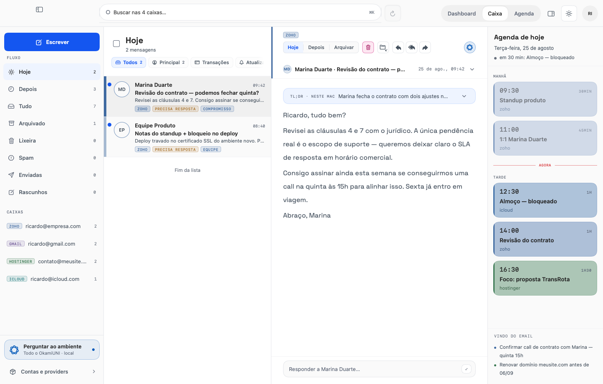
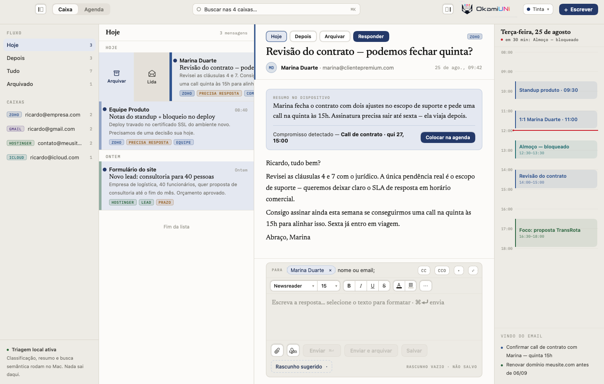
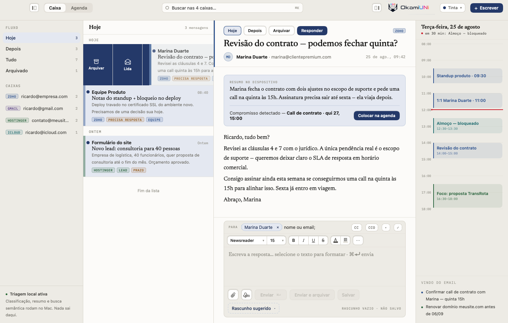

<div align="center">

# 🐺 OkamiUNI

**Email e agenda, juntos, nativos, do jeito que o macOS merece.**




</div>

## TL;DR

- 📬 **Um app só** para email e agenda — a trilha do dia mora ao lado do leitor, e selecionar uma caixa filtra **as duas**.
- 🖱️ **Ações onde a mão espera**: botão direito em toda superfície, arraste lateral na linha (configurável, com Desfazer), atalhos de verdade (`⌘R` `⇧⌘R` `⇧⌘F` `⌘E` `⌫` `⇧⌘L` `⇧⌘U` `⌘N` `⌘K`).
- ✍️ **Composer rico de verdade**: negrito que muda a fonte, tabela que sobrevive ao Enter, hyperlink, justificado, qualquer cor, todas as fontes do sistema.
- 🎨 **26 temas**, hairlines de 1 pixel em telas 1×, semáforos a 22pt do topo — o polimento é requisito, não acabamento.
- 🔌 **Qualquer provedor**: as quatro contas de exemplo são fixtures de design; nada no código limita provedor, domínio ou número de contas.
- ✅ **1088 testes** que provam por mutação: cada teste novo só conta depois de falhar com o defeito reintroduzido.

```bash
Tools/rodar.sh     # mata a instância antiga, regenera o projeto, compila e abre
```

---

## Por que existe

Cliente de email é o app que mais horas passa aberto — e o que menos respeito costuma receber: web view, ações escondidas, agenda em outro app. O OkamiUNI nasce do desenho ([`design/`](design/), a fonte da verdade deste repositório) para o binário nativo, com uma regra que atravessa tudo: **controle que existe faz alguma coisa** — ou aparece desabilitado explicando por quê. Botão mudo é defeito, não estado.

## O que já funciona (Marco 1 — o shell)

| Área | O que tem |
|---|---|
| 📥 **Caixa de entrada** | Fluxo de triagem (Hoje · Depois · Tudo · Arquivado · **Lixeira**), busca que dobra acento ("Revisao" acha "Revisão"), filtro por conta que alcança lista **e** agenda, ponto + fundo de não-lida, estrela de sinalizada |
| 📖 **Leitor** | Resumo no dispositivo, compromisso detectado com **"Colocar na agenda"** (e o caminho de volta), resposta rápida com formatação que sobrevive à promoção **⤢** para a janela |
| ↔️ **Arraste na linha** | Duas ações por lado, persistidas e configuráveis; a linha **para** aberta, o disparo longo inunda de cor antes de executar, destrutivo tem Desfazer |
| 🖱️ **Botão direito** | Menu custom no idioma do design em 10 superfícies — responder, responder a todos, encaminhar, arquivar, apagar, sinalizar, mover, copiar; submenu, atalhos exibidos, navegação por teclado (↑↓⏎→← Esc) |
| ⌨️ **Atalhos** | Menu **Mensagem** na barra do sistema; `⌘R` responder · `⇧⌘R` responder a todos · `⇧⌘F` encaminhar · `⌘E` arquivar · `⌫` apagar · `⇧⌘L` sinalizar · `⇧⌘U` lida/não lida · `⌘N` nova · `⌘K` busca — e campo de texto nunca perde tecla sem modificador |
| 📅 **Agenda** | Trilha do dia ao lado do email; aba própria com **Dia / Semana / Mês**, navegação ‹ › nas três, seletor de data que acompanha o foco, "agora" só onde é agora |
| ✍️ **Composer** | NSTextView de verdade: formatação **na seleção**, tabelas (Enter não quebra), hyperlink, justificado, cor livre, fontes do sistema, assinatura por conta |
| 🪟 **Janelas** | Composer, nova mensagem, mensagem destacada e detalhe de compromisso são cenas reais (⌘W, menu Janela, uma por valor) |
| 🎨 **Shell** | 26 temas com tokens de ponta a ponta, hairlines de 1 pixel de dispositivo, semáforos a 22pt, duplo clique na barra respeitando a preferência do sistema, painéis redimensionáveis com intenção preservada |
| 🔐 **Contas de verdade** (Marco 2) | OAuth do Google com PKCE, IMAP para qualquer provedor com detecção de servidor, segredos no Keychain, cache local em SQLite com busca no corpo (FTS5, acento dobrado) e carga dos últimos 90 dias — o app abre **offline**. Sem conta conectada, ele continua sendo o shell do Marco 1, com as fixtures |
| 🔄 **Sincronização de verdade** (Marco 3) | As contas se mantêm sozinhas: IMAP IDLE com delta de bandeiras, Gmail incremental por histórico, e a rede que volta acorda tudo. Corpos MIME decodificados de verdade (multipart, quoted-printable, charsets) com busca sob demanda ao abrir. Toda ação (arquivar, apagar, lida, estrela) persiste numa **fila transacional** espelhada no servidor — funciona offline, com retry, e falha permanente para com explicação e "tentar de novo". **Enviar envia**: Gmail pela API, IMAP por SMTP próprio (STARTTLS), com caixa Enviadas e idempotência por Message-ID. Contatos do autocomplete vêm das caixas reais |

<div align="center">
<table>
<tr>
<td align="center"><br/><sub>O arraste <b>para</b> aberto…</sub></td>
<td align="center"><br/><sub>…e <b>inunda</b> antes de disparar.</sub></td>
</tr>
</table>
</div>

## Como rodar

Pré-requisitos: **Xcode 26.6+** (Swift 6.3) e [XcodeGen](https://github.com/yonaskolb/XcodeGen) (`brew install xcodegen`).

```bash
git clone https://github.com/OkamiOps/okamiuni.git
cd okamiuni
Tools/rodar.sh
```

O script encerra a instância anterior, limpa o estado salvo da janela, regenera o `.xcodeproj`, compila, imprime a data do binário e o commit, e abre o app.

## Arquitetura

Quatro pacotes Swift e um princípio: **lógica pura fora das views** — uma `View` SwiftUI é `@MainActor` implícito, e tudo que merece teste nonisolated mora em `UNICore`.

| Pacote | Papel | Exemplos |
|---|---|---|
| `Packages/UNICore` | Modelo e lógica pura, sem SwiftUI | `MailStore`, `SwipeGestureMachine`, `ComposerSeed`, `WeekAgenda`/`MonthAgenda`, `ContextMenus`, `MenuPlacement`, `PaneLayout` |
| `Packages/UNIDesign` | O sistema de temas — 26 temas, tokens de cor, tipografia, fontes embarcadas | `Theme`, `ThemeStore`, `FontRegistry` |
| `Packages/UNIShell` | As telas e o chrome da janela | `InboxScreen`, `CalendarScreen`, `ComposerWindow`, `WindowChrome`, os menus custom |
| `Packages/UNISync` | Contas e sincronização: OAuth, IMAP sobre SwiftNIO, Keychain, o banco GRDB | `AccountDirector`, `GoogleAuth`, `ImapSession`, `InitialLoader`, `SyncDatabase` |

```
App/  ──▶  UNIShell  ──▶  UNIDesign
                └───────▶  UNICore  ◀──  UNISync  ──▶  (Keychain · GRDB · Gmail API · IMAP)
```

O projeto Xcode é gerado por [`project.yml`](project.yml) (XcodeGen) com `SWIFT_STRICT_CONCURRENCY: complete`. O desenho original — HTML navegável — vive em [`design/`](design/) e é tratado como especificação: quando uma medida está em dúvida, o protótipo é servido e **medido**, não lido.

## Como este projeto se testa

**Swift Testing** (nunca XCTest), 1088 testes em quatro pacotes — e uma regra que virou cultura depois de uma auditoria dedicada: **teste que passa com o código quebrado é defeito**. Doze testes foram condenados por mutação e substituídos; todo teste novo nasce provado vermelho com o defeito reintroduzido.

Três instrumentos fazem o app testemunhar contra si mesmo, sem tocar no mouse de ninguém:

| Instrumento | Bandeira | O que faz |
|---|---|---|
| Captura | `--capturar` | A janela real se fotografa e encerra — pixels do AppKit, não de um harness |
| Ensaio de arraste | `--ensaiar-arraste` | Eventos de mouse sintetizados **dentro do processo** (`NSWindow.sendEvent`), uma foto por fase do gesto |
| Ensaio de teclado / barra | `--ensaiar-teclado` · `--ensaiar-barra` | Cada atalho e o duplo clique na barra, aferidos no caminho real dos eventos |
| Ensaio de contas | `--ensaiar-contas` | O fluxo inteiro de conectar uma conta, contra um servidor IMAP falso em loopback — banco descartável, Keychain intocado |

Foi o ensaio de arraste que pegou o defeito que três rodadas de teste de modelo não viam: no macOS, um `Button` dispara no mouse-up mesmo depois de a mão andar 200pt — e a linha inteira é um botão. O registro completo dessas decisões está em [`docs/decisoes-de-engenharia.md`](docs/decisoes-de-engenharia.md).

```bash
for p in UNICore UNIDesign UNIShell UNISync; do (cd "Packages/$p" && swift test); done
```

## Roteiro

- [x] **Marco 1 — Shell**: tudo acima, com as quatro contas vindo de fixtures
- [x] **Marco 2 — Contas**: OAuth do Google (PKCE), IMAP para qualquer provedor, Keychain, banco SQLite local-first com FTS5, carga de 90 dias retomável, janela de Contas
- [x] **Marco 3 — Sincronização**: sync contínuo (IDLE + histórico incremental), corpos MIME, fila de ações espelhada no servidor, envio (Gmail API + SMTP), Enviadas, contatos reais
- [ ] **Marco 4 — Agenda real**: EventKit; "Reagendar" volta, "Tirar da agenda" alcança tudo
- [ ] **Marco 5 — Inteligência no dispositivo**: resumo e detecção de compromisso deixando as fixtures

Dívidas deliberadas do Marco 1, registradas: caixa "Sinalizadas", tela de preferências do arraste, menu custom no editor do composer (hoje ele **acrescenta** ao menu do sistema para não perder ortografia e serviços).

## Princípios de engenharia

1. **O design é a especificação.** O HTML em `design/` decide medida, cor e comportamento; divergência é bug com número dos dois lados.
2. **Nenhum controle mudo.** Faz, ou explica por que não pode.
3. **Nada limita contas.** Provedor, domínio e quantidade são ilimitados por construção.
4. **Fuso horário não atravessa o modelo.** Horário é minuto-do-dia, dia é deslocamento inteiro — `Date` só nas bordas.
5. **Prova no app real.** Conserto de interação só conta com ensaio antes e depois, no caminho real dos eventos.
6. **Telas 1× importam.** Meia unidade de ponto é zero ou um pixel; hairline é `1/displayScale`, borda é `strokeBorder`, nunca `.stroke` fino.

---

<div align="center">
<sub>Feito com Swift, teimosia e um desenho que veio primeiro. 🐺</sub>
</div>
